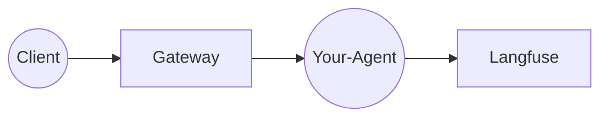

# Agent Template

[](https://github.com/agentsystems/agentsystems/stargazers)

> [!NOTE]
> **Pre-Release Software** - AgentSystems is in active development. Join our [Discord](https://discord.com/invite/JsxDxQ5zfV) for updates and early access.
> ⭐ [**Star the main repository**](https://github.com/agentsystems/agentsystems) to show your support!

> This is the **reference agent template** for AgentSystems. See the [main repository](https://github.com/agentsystems/agentsystems) for platform overview and documentation.

A minimal starter for building containerized AI agents that plug into the [Agent Systems](https://github.com/agentsystems) platform.

*   Built on FastAPI + LangChain + LangGraph
*   Uses OCI standard labels for container metadata
*   No version tags or Docker image are published here – **this repo is a template**, not a distributable agent


The **Agent Template** is a minimal, batteries-included starter repo for building container-ised AI agents that plug into the [Agent Control Plane](https://github.com/agentsystems/agent-control-plane).

This repo is intended to be used via GitHub’s **“Use this template”** button or the `gh repo create` CLI. It can also be cloned directly for experiments.

---

## What you get

| Path / file | Purpose |
|-------------|---------|
| `main.py` | FastAPI app exposing `/invoke` and `/health` endpoints. Contains an `invoke()` function you can customize. |
| `Dockerfile` | Multi-stage Python 3.13 image with OCI labels, license attribution, and healthcheck. |
| `requirements.txt` | Runtime dependencies. |
| Langfuse tracing | Pre-configured via `agentsystems-toolkit` for observability. |

**Note**: Agent metadata (model dependencies, egress requirements, setup instructions) is defined in the [agent-index](https://github.com/agentsystems/agent-index) when you publish your agent, not in the container itself.

---

## Where it fits



1. Client calls `POST /your-agent` on the Gateway.
2. Gateway forwards to your container’s `/invoke` endpoint and injects `X-Thread-Id`.
3. Your code adds Langfuse traces and responds with JSON.

---

## Quick start

### Run via Docker Compose (spec-compliant)

```bash
docker compose -f compose/docker-standard.yml up --build
```

After a few seconds check <http://localhost:8000/docs> for the swagger UI.

---

### Run with hot-reload (local python)

1. Click **"Use this template"** on GitHub and create a new repository (e.g. `johndoe/my-agent`).
2. Clone your new repo and customize `main.py`:
   - Update the FastAPI app metadata (lines 38-42)
   - Modify the `State`, `InvokeRequest`, and `InvokeResponse` models
   - Implement your agent logic in the graph nodes
3. Start the agent locally with hot-reload:

```bash
python -m venv .venv && source .venv/bin/activate
pip install -r requirements.txt
uvicorn main:app --reload --port 8000
```

Open <http://localhost:8000/docs> to test the `/invoke` endpoint.

---
## Container health check

AgentSystems CLI waits until Docker marks your container `healthy` before routing traffic. Add a simple `HEALTHCHECK` to your `Dockerfile` so the platform knows when the agent is ready:

```dockerfile
# after EXPOSE 8000
ENV PORT 8000
HEALTHCHECK --interval=10s --retries=3 CMD curl -sf http://localhost:${PORT}/health || exit 1
```

The template exposes a `GET /health` endpoint that returns 200, so the example healthcheck will work with the default app.

---
## Build a Docker image

Build your agent image with standard Docker commands:

```bash
docker build -t yourname/my-agent:0.1.0 .
```

To embed metadata in OCI labels (recommended):

```bash
docker build \
  --build-arg AGENT_NAME="my-agent" \
  --build-arg AGENT_DESCRIPTION="My custom agent" \
  --build-arg AGENT_DEVELOPER="yourname" \
  --build-arg VERSION="0.1.0" \
  -t yourname/my-agent:0.1.0 \
  .
```

Then push to your registry:

```bash
docker push yourname/my-agent:0.1.0
```

---

## Wire into a deployment

Add the service to [`agent-platform-deployments`](https://github.com/agentsystems/agent-platform-deployments):

```yaml
# compose/local/docker-compose.yml
  echo-agent:
    image: mycorp/echo-agent:0.1
    networks:
      - agents-int
    labels:
      - agent.enabled=true
      - agent.port=8000
```

The Gateway should now route `POST /echo-agent` to your container (once the container is healthy and registered).

---

## Environment variables

| Var | Purpose |
|-----|---------|
| `LANGFUSE_PUBLIC_KEY` / `LANGFUSE_SECRET_KEY` | Needed for Langfuse tracing. |
| Any model API keys | e.g. `OPENAI_API_KEY`, `ANTHROPIC_API_KEY` – accessed in `invoke()`. |

---

## File Uploads & Artifacts

Agents can receive file uploads and access shared artifacts through the `/artifacts` volume mounted at runtime. The platform uses a thread-centric structure where each request gets its own directory.

### File Upload Workflow

Upload files using multipart requests to the gateway:

```bash
# Upload file with JSON payload
curl -X POST http://localhost:18080/invoke/agent-template \
  -H "Authorization: Bearer your-token" \
  -F "file=@input.txt" \
  -F 'json={"sync": true}'
```

### Artifacts Directory Structure

```
/artifacts/
├── {thread-id-1}/
│   ├── in/          # Input files (uploaded by client)
│   │   └── input.txt
│   └── out/         # Output files (created by agent)
│       └── result.txt
└── {thread-id-2}/
    ├── in/
    └── out/
```

### Reading Input Files

```python
# In your agent's invoke() function
thread_id = request.headers.get("X-Thread-Id", "")
in_dir = pathlib.Path("/artifacts") / thread_id / "in"

# Check for uploaded files
if (in_dir / "data.txt").exists():
    content = (in_dir / "data.txt").read_text()
```

### Writing Output Files

```python
# Create output directory and write results
out_dir = pathlib.Path("/artifacts") / thread_id / "out"
out_dir.mkdir(parents=True, exist_ok=True)
(out_dir / "result.txt").write_text("Processing complete")
```

### Accessing Artifacts Outside Agents

Check artifacts from any container with the volume mounted:

```bash
# List all threads
docker exec local-gateway-1 ls -la /artifacts/

# Read specific output file
docker exec local-gateway-1 cat /artifacts/{thread-id}/out/result.txt

# Use CLI helper
agentsystems artifacts-path {thread-id} result.txt
```

---

## Tips & conventions

* Keep the container port consistent (8080 or 8000); the Gateway connects over the internal Docker network, so host port mapping is optional.
* You should return JSON with the `thread_id` you received – this keeps the audit log and Langfuse trace in sync.
* Use the [Add a New Agent guide](../docs/guides/add-agent) when integrating into the full stack.

---

## Publishing Your Agent

To make your agent discoverable in the AgentSystems platform:

1. Build and push your Docker image to a container registry
2. Publish metadata to the [agent-index](https://github.com/agentsystems/agent-index)
3. Users can discover and install your agent via the platform UI

See the [AgentSystems documentation](https://docs.agentsystems.ai) for detailed publishing instructions.

---

## Contributing

Issues and PRs are welcome – feel free to open a discussion if you need changes to the template.


## Getting Started (local)

1. Use this template to create your own repository.
2. Customize `main.py`:
   - Update FastAPI metadata
   - Define your request/response models
   - Implement your agent logic
3. Build and run locally (see sections above).

   **Request contract**
   - Client must include `Authorization: Bearer <token>` header (any placeholder for now).
   - Gateway injects `X-Thread-Id: <uuid>` header before forwarding to the agent.

   **Response contract**
   - JSON must include the same `thread_id` so audit logs can correlate request/response pairs.

   Example curl (once the agent is behind the gateway):
   ```bash
   curl -X POST localhost:18080/my-agent \
        -H 'Content-Type: application/json' \
        -d '{"prompt": "Hello"}'
   ```
   Response:
   ```json
   {
     "thread_id": "550e8400-e29b-41d4-a716-446655440000",
     "reply": "Echo: Hello",
     "timestamp": "2025-06-16T09:34:00Z"
   }
   ```
4. Build & run locally:

```bash
docker build -t my-agent .
docker run -p 8000:8000 my-agent
```

5. Test:

```bash
curl -X POST localhost:8000/invoke -H 'Content-Type: application/json' \
     -d '{"prompt": "Hello"}'
```


## Using in deployments

In production you usually build & push the image, then reference it in the deployment bundle stored in [`agent-platform-deployments`](https://github.com/agentsystems/agent-platform-deployments).

```
# example snippet in compose/local/docker-compose.yml
my-agent:
  image: mycorp/my-agent:1.0
  labels:
    - agent.enabled=true
    - agent.port=8000
```

The Gateway will auto-discover the container and route `POST /my-agent` to its `/invoke` endpoint.

---

## Continuous Integration (GitHub Actions)

The project ships with a `ci.yml` workflow that now goes beyond linting:

1. Runs pre-commit hooks (ruff, black, shellcheck, hadolint).
2. Builds the agent Docker image.
3. Starts the container mapped to `localhost:9800` (internal port 8000).
4. Polls `http://localhost:9800/health` for up to 60 s and fails the job if the endpoint never returns **200 OK**.
5. Removes the container in a cleanup step.

This helps verify that PRs produce images that boot successfully and expose the health endpoint.

## License

Licensed under the [Apache-2.0 license](./LICENSE).
