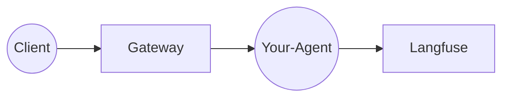

# Agent Template

A minimal, batteries-included starter for building containerised AI agents that plug into the [Agent Systems](https://github.com/agentsystems) platform.

*   Built on FastAPI + LangChain
*   Comes with a Dockerfile and a `build_and_release.sh` wrapper
*   No version tags or Docker image are published here – **this repo is a template**, not a distributable agent


The **Agent Template** is a minimal, batteries-included starter repo for building container-ised AI agents that plug into the [Agent Control Plane](https://github.com/agentsystems/agent-control-plane).

This repo is intended to be used via GitHub’s **“Use this template”** button or the `gh repo create` CLI. It can also be cloned directly for experiments.

---

## What you get

| Path / file | Purpose |
|-------------|---------|
| `main.py` | FastAPI app exposing `/invoke`, `/health`, `/metadata`. Contains an `invoke()` function you can customise. |
| `agent.yaml` | Declarative metadata (e.g. `name`, `description`) read by the Gateway for routing. |
| `Dockerfile` | Slim Python 3.12 image that installs dependencies and runs the agent. |
| `requirements.txt` | Runtime dependencies. |
| Langfuse callback | `langfuse.langchain.CallbackHandler` pre-wired so every LangChain call is traced. |

---

## Where it fits


```mermaid
graph LR
  client((Client)) --> gateway[Gateway]
  gateway --> agent((Your-Agent))
  agent --> lf[Langfuse]
```

1. Client calls `POST /your-agent` on the Gateway.
2. Gateway forwards to your container’s `/invoke` endpoint and injects `X-Thread-Id`.
3. Your code adds Langfuse traces and responds with JSON.

---

## Quick start

1. Click **“Use this template”** on GitHub and create a new repository (e.g. `johndoe/echo-agent`).
2. Clone your new repo and update `agent.yaml` (`name`, `description`, etc.).
3. Start the agent locally with hot-reload:

```bash
python -m venv .venv && source .venv/bin/activate
pip install -r requirements.txt
uvicorn main:app --reload --port 8000
```

Open <http://localhost:8000/docs> to test the `/invoke` endpoint.

---

## Build & release a Docker image

Use the wrapper script to build (and optionally push) a versioned multi-arch image:

```bash
./build_and_release.sh \
  --image johndoe/echo-agent \
  --version 0.1.0 \
  --push          # omit --push to build locally only
```

What it does:

* Builds the container image and tags it `0.1.0` (plus `latest` if no suffix)
* Pushes to Docker Hub when `--push` is present
* Creates a Git tag **only** when you also pass `--git-tag`

---

## Wire into a deployment

Add the service to [`agent-platform-deployments`](https://github.com/agentsystems/agent-platform-deployments):

```yaml
# compose/local/docker-compose.yml
  echo-agent:
    image: mycorp/echo-agent:0.1
    networks:
      - agents-net
    labels:
      - agent.enabled=true
      - agent.port=8000
```

The Gateway will now route `POST /echo-agent` to your container.

---

## Environment variables

| Var | Purpose |
|-----|---------|
| `LANGFUSE_PUBLIC_KEY` / `LANGFUSE_SECRET_KEY` | Needed for Langfuse tracing. |
| Any model API keys | e.g. `OPENAI_API_KEY`, `ANTHROPIC_API_KEY` – accessed in `invoke()`. |

---

## Tips & conventions

* Keep the container port consistent (8080 or 8000); the Gateway connects over the internal Docker network, so host port mapping is optional.
* Always return JSON with the `thread_id` you received – this keeps the audit log and Langfuse trace in sync.
* Use the [Add a New Agent guide](../docs/guides/add-agent) when integrating into the full stack.

---

## Release checklist

1. Update `version` label (if you tag images).  
2. `docker build` & push to registry.  
3. Update the image tag in the deployment manifests.  
4. Run `make restart` (compose) or `helm upgrade` (k8s) to pick up the change.

---

## Contributing

Issues and PRs are welcome – feel free to open a discussion if you need changes to the template.


## Getting Started (local)


1. Clone this repo (or let `agenctl init` do it for you).
2. Edit `agent.yaml` (`name`, `description`, etc.).
3. Extend the Pydantic request/response models in `main.py` and replace the logic in `invoke()`.

   **Request contract**
   - Client must include `Authorization: Bearer <token>` header (any placeholder for now).
   - Gateway injects `X-Thread-Id: <uuid>` header before forwarding to the agent.

   **Response contract**
   - JSON must include the same `thread_id` so audit logs can correlate request/response pairs.

   Example curl (once the agent is behind the gateway):
   ```bash
   curl -X POST localhost:18080/my-agent \
        -H 'Content-Type: application/json' \
        -d '{"prompt": "Hello"}'
   ```
   Response:
   ```json
   {
     "thread_id": "550e8400-e29b-41d4-a716-446655440000",
     "reply": "Echo: Hello",
     "timestamp": "2025-06-16T09:34:00Z"
   }
   ```
4. Build & run locally:

```bash
docker build -t my-agent .
docker run -p 8000:8000 my-agent
```

5. Test:

```bash
curl -X POST localhost:8000/invoke -H 'Content-Type: application/json' \
     -d '{"prompt": "Hello"}'
```


## Using in deployments

In production you usually build & push the image, then reference it in the deployment bundle stored in [`agent-platform-deployments`](https://github.com/agentsystems/agent-platform-deployments).

```
# example snippet in compose/local/docker-compose.yml
my-agent:
  image: mycorp/my-agent:1.0
  labels:
    - agent.enabled=true
    - agent.port=8000
```

The Gateway will auto-discover the container and route `POST /my-agent` to its `/invoke` endpoint.


